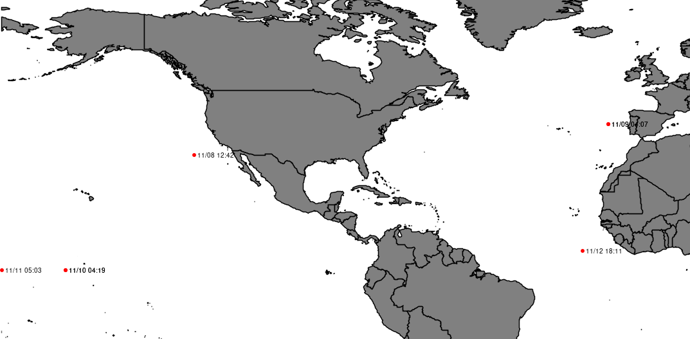

# ISS TLE Tracking

A simple Java program to track the ISS data returned from the TLE API:  
https://api.nasa.gov/

```
mvn compile
mvn exec:java -Dexec.mainClass="whiterabbit.ISSDataFetcher"
mvn exec:java -Dexec.mainClass="whiterabbit.ISSPositionCalculator"
mvn exec:java -Dexec.mainClass="whiterabbit.ISSMapVisualizer"
```



